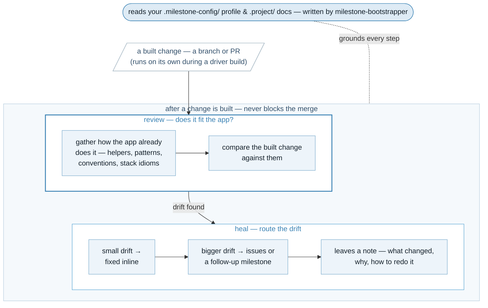

<p align="center">
  
</p>

After a change is built, checks whether it fits how the rest of the app is already built — existing helpers and patterns, your conventions, the stack's idioms — then fixes small drift inline and files bigger drift as issues or a follow-up milestone. Never blocks the merge; leaves a short note on what it changed, why, and how to redo it. Distinct from code review (correctness) and triage (design).



## How to use

In the suite, it runs on its own during a `milestone-driver` build — you don't invoke it. Standalone, point it at a branch or PR:

```
/milestone-coherence-reviewer:review <branch-or-PR>
```

## Requires

`superpowers` (from `claude-plugins-official`) — the milestone-suite's shared prerequisite. It's no longer installed automatically, so add it yourself; the `milestone-driver` and `milestone-feeder` tools that drive and feed this reviewer need it to run the suite.

```
/plugin marketplace add anthropics/claude-plugins-official
/plugin install superpowers@claude-plugins-official
```

## Status

v0.1.0 — built and released. Spec in [BRIEF.md](BRIEF.md); built by `milestone-feeder` + `milestone-driver`. Part of the [dev-tools](../dev-tools) suite.
